# Hi there, I'm Mr.lonely 👋

Building full-stack experiences, AI tools, quant systems, and fun side projects.

I completed R&D internships at Douyin Risk Control, Meituan Service Retail, and Meituan Infrastructure R&D Platform. I now work as an R&D engineer at Meituan Instashopping Tech.

 

 

 

## Codex Token Activity

  

## GitHub at a glance

  
  

  <a href="https://github.com/ashutosh00710/github-readme-activity-graph">
    <picture>
      <source media="(prefers-color-scheme: dark)" srcset="https://github-readme-activity-graph.vercel.app/graph?username=mameikagou&amp;theme=github-dark&amp;hide_border=true" />
      
    </picture>
  </a>

## GitHub Roast

  <a href="https://ghfind.com/u/mameikagou?ref=badge">
    <picture>
      <source media="(prefers-color-scheme: dark)" srcset="https://ghfind.com/api/card/mini/mameikagou?theme=dark&amp;lang=zh" />
      
    </picture>
  </a>

